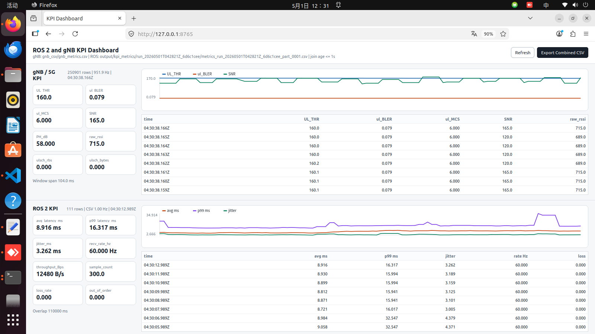

# OAI Robot Arm

[](LICENSE)

**OAI Robot Arm** is the 5G base station configuration section of the network remote-control artifact. It supports **millisecond-level base station dataset collection and uplink/downlink PRB configuration**.

## 🚀 Installation Guide

### Prerequisites

The prerequisites vary by component:

- **User Equipment (UE):**
  - Ubuntu 22.04 and ros2 humble
  - RM520N_GL for 5G terminal module

- **gNB (Base Station):**
  - Ubuntu 22.04 and ros2 humble
  - Compatible CPU (e.g., Intel i7 or higher)
  - USRP hardware (e.g., B210)
  - **UHD libraries and drivers** (for USRP support)

- **Core Network (CN) with Edge Server:**
  - Ubuntu 20.04
  - Docker 28.1.1 

- **ROS2 based on OAI:**
  - zenoh RMW (both gNB and UE)
  ```sh
    sudo apt install ros-humble-rmw-zenoh-cpp
   ```

### Installation Steps

#### 1. Core Network (CN)

For detailed guidance, refer to the [NR_SA_Tutorial_OAI_CN5G](oai_custom/doc/NR_SA_Tutorial_OAI_CN5G.md) document. After installation, you need to configure the router.

1. **IP config**
   ```sh
    sudo sysctl net.ipv4.conf.all.forwarding=1
    sudo iptables -P FORWARD ACCEPT
    sudo iptables -F FORWARD
   ```

#### 2. gNB (Base Station)

The gNB installation is based on a modified version of OpenAirInterface (OAI) for this project. For dependency installation, you can check [NR_SA_Tutorial_OAI_COST_UE](oai_custom/doc/NR_SA_Tutorial_COTS_UE.md) document. After the dependencies are installed:

1. **Enter the artifact copy of the OAI gNB source tree**
   ```sh
   cd /path/to/anonymized_artifact/code/oai_gnb_kpi_recorder/oai_custom
   ```

4. **Set up the environment**
   ```sh
   source oaienv
   cd cmake_targets
   ```

5. **Compile gNB**
Before compile, set the save path for `gnb_metrics.csv` in `oai_custom/openair2/LAYER2/NR_MAC_gNB/main.c` around line 195. Manual configuration required for the local OAI/gNB/SDR deployment. Then:
   ```sh
   ./build_oai -I
   ./build_oai -w USRP --gNB --ninja -c
   ```
   **Note:** The compilation may fail due to an asn1c version mismatch. In this case, you can first compile a newer version of OAI gnb, and then compile this project again. In this case, you don't need to run `./build_oai -I`.

6. **Configure gNB**
   - Edit the configuration file (e.g., `robort_arm_b210.conf`) to set the correct frequency band, hardware parameters, and UHD options.
   - Manual configuration required for the local OAI/gNB/SDR deployment.

6. **Configure gNB IP**
   ```sh
    sudo sysctl net.ipv4.conf.all.forwarding=1
    sudo iptables -P FORWARD ACCEPT
    sudo iptables -F FORWARD
    sudo ip route add <ue-subnet-cidr> via <cn-host-ip>
   ```

7. **Time synchronization, new terminal**
   ```sh
    sudo systemctl restart chrony
    sudo systemctl enable chrony
    chronyc sources -v
    chronyc tracking
   ```

8. **Run gNB**
   ```sh
   cd ran_build/build
   sudo ./nr-softmodem -O /path/to/local/gnb.conf --sa -E
   ```

9. **New terminal, run the zenoh rmw**
   ```sh
    source /opt/ros/humble/setup.bash
    ros2 daemon stop || true
    export ZENOH_CONFIG_OVERRIDE='listen/endpoints=["tcp/0.0.0.0:7447"]'
    ros2 run rmw_zenoh_cpp rmw_zenohd
   ```

10. **New terminal, run the ROS2 related node**
   Mujoco:
   ```sh
   export RMW_IMPLEMENTATION=rmw_zenoh_cpp
   Waitting...
   ```
   ros2 KPI metrics:
   ```sh
   export RMW_IMPLEMENTATION=rmw_zenoh_cpp
   Waitting...
   ```
   Dashboard (optional):
   ```sh
   export RMW_IMPLEMENTATION=rmw_zenoh_cpp
   Waitting...
   ```

#### 3. UE

**dependency and robort arm**
   ```sh
    waitting dependency.......
    sudo chmod 666 /dev/ttyACM0
   ```
Then, access the installed `oai_cn5g/database` file and edit the SIM card according to the configuration in the database. Details can be found in [NR_SA_Tutorial_OAI_COST_UE](oai_custom/doc/NR_SA_Tutorial_COTS_UE.md). Alternatively, other LTE/5G SIM card editing software can also be used. After the UE successfully accesses the core network, for example by pinging `<cn-host-ip>` from the UE:

1. **Time synchronization**
   ```sh
    sudo systemctl restart chrony
    sudo systemctl enable chrony
    chronyc sources -v
    chronyc tracking
   ```

2. **zenoh rmw, new terminal**
   ```sh
    source /opt/ros/humble/setup.bash
    ros2 daemon stop || true
    export RMW_IMPLEMENTATION=rmw_zenoh_cpp
    export ZENOH_CONFIG_OVERRIDE='mode="client";connect/endpoints=["tcp/<gnb-zenoh-ip>:7447"]'
   ```

3. **ROS2 node start, the same terminal*
   ```sh
   Waitting....
   ```

## 🛠 API Usage

1：If you want to change the number of PRBs allocated to the UE to further study the impact of communication resource allocation on latency, you can do so using the following two scripts：
   ```sh
   cd oai_custom/
   python gNBControllerUplink.py (only for Uplink)
   python gNBController.py (Downlink is ok) 
   ```

2：We also provide a dashboard interface to facilitate visualization of supervised operations and interactions with small datasets. It can be started using the following command：
   ```sh
   cd /path/to/anonymized_artifact/code/ros2_kpi_toolkit
   source install/setup.bash
   export RMW_IMPLEMENTATION=rmw_zenoh_cpp
   python3 ./tools/kpi_dashboard.py
   ```
And The dashboard interface is as follows:


3: More API is coming soon.....

## 📄 License

This component includes modified OpenAirInterface source code. See `oai_custom/LICENSE` and `oai_custom/NOTICE.md` for the OAI license and third-party notices. Repository-level licensing for the surrounding anonymized supplementary artifact is described in the top-level `LICENSE`.

## 🔗 References

- 🌐 This project is based on [OAI](https://gitlab.eurecom.fr/oai/openairinterface5g/) and modifies it, referencing some implementations from the NEU-INTEL Labs.
